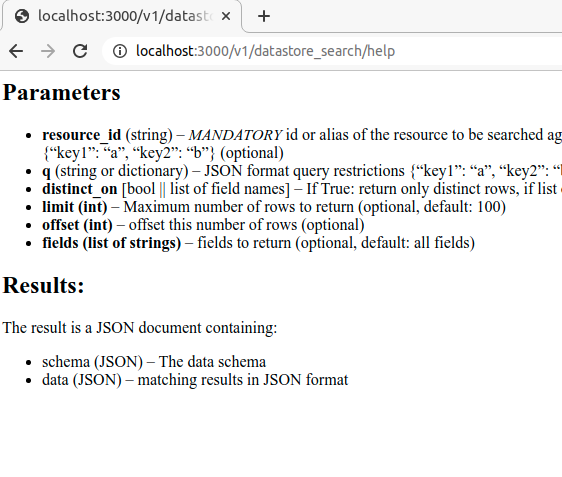
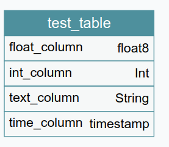
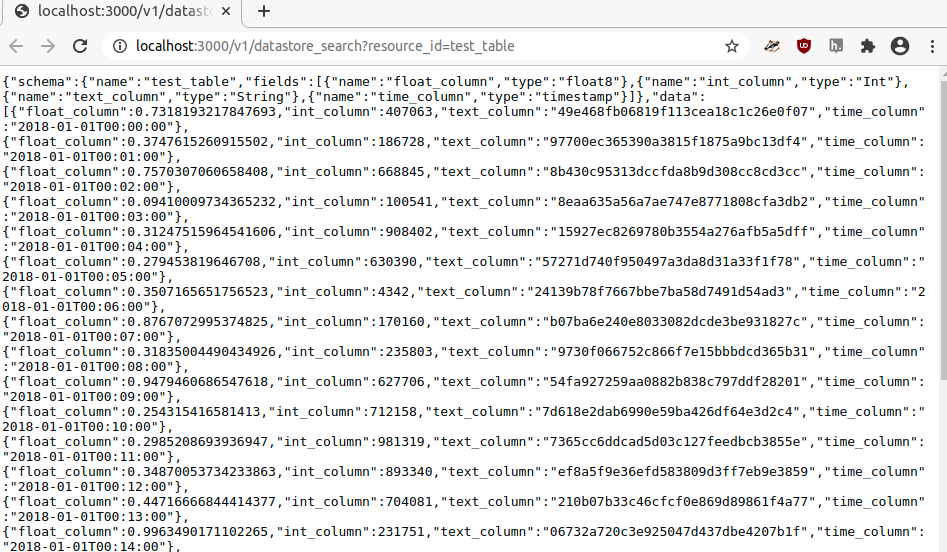
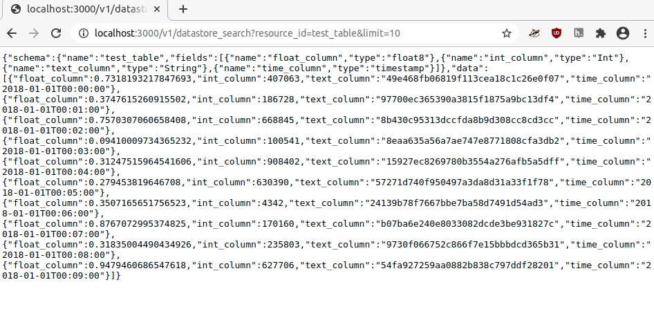
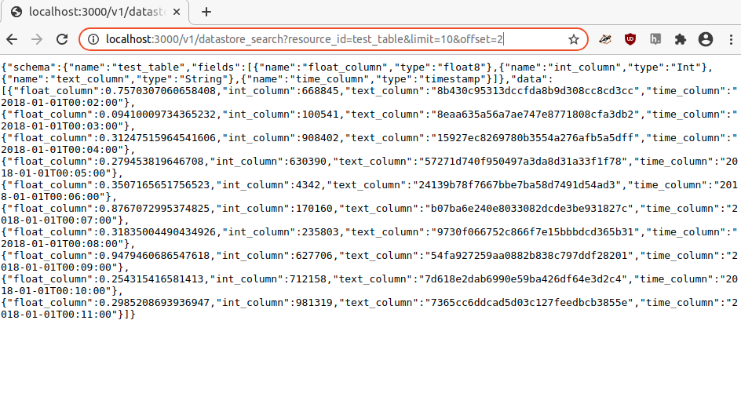

# Data API

For data management systems including [CKAN](https://ckan.org/).

## Features

- GraphQL endpoint
- Bulk export of data to json/csv/xlsx files
- `datastore_search` endpoint (similar to [CKAN Datastore extention](https://docs.ckan.org/en/latest/maintaining/datastore.html))

## Version

The current version is **v1**

**APP_VERSION** = 'v1'

## Usage

### Endpoints

- /{APP_VERSION}/graphql
- /{APP_VERSION}/download
- /{APP_VERSION}/datastore_search
- /{APP_VERSION}/datastore_search/help

### GraphQL Endpoint

GraphQL Endpoint exposes the hasura GraphQL API.

For the GraphQL documentation please refer to [Hasura Documentation](https://hasura.io/docs/1.0/graphql/core/index.html)

### datastore_search endpoing

#### Parameters

- **resource_id** (string) – _MANDATORY_ id or alias of the resource to be searched against
- **q** (string or dictionary) – JSON format query restrictions {“key1”: “a”, “key2”: “b”}, it’ll search on each specific field (optional)
- **distinct_on** [bool || list of field names] – If True: return only distinct rows, if list of fields will return only
- **limit (int)** – Maximum number of rows to return (optional, default: 100)
- **offset (int)** – offset this number of rows (optional)
- **fields (list of strings)** – fields to return (optional, default: all fields)
- ~~sort (string) – comma separated field names with ordering e.g.: “fieldname1, fieldname2 desc”~~ Not implemented yet
- ~~filters (dictionary) – matching conditions to select, e.g {“key1”: “a”, “key2”: “b”} (optional)~~ Not implemented - similar to **q**

#### Results:

The result is a JSON document containing:

- **schema** (JSON) – The data schema
- **data** (JSON) – matching results in JSON format
- ~~fields (list of dictionaries) – fields/columns and their extra metadata~~ Not Implemented
- ~~offset (int) – query offset value~~ Not implemented
- ~~total (int) – number of total matching records~~ Not implemented

## Examples

### Help page

### Basic query with limit

With a test table having the following schema:

We can make different queries:

#### Query Table

#### Query Table with Limit

#### Query Table with Limit and Offset (pagination)

## Contributing

1. copy env variables - `cp .env.example .env`
2. set up background services - this repo contains a mock environment you can launch with `bash run-mock-environment.sh` or if connecting to an existing one edit the URLs in the `.env` file
3. install dependencies - `yarn`
4. `yarn start` to launch server / `yarn test` to run tests
5. setup automatic code formatter - install and use [prettier](https://prettier.io/docs/en/install.html), if using vscode install [prettier-vscode extention](https://marketplace.visualstudio.com/items?itemName=esbenp.prettier-vscode)

Please don't forget to add new variables to `.env.example` - they also will be used in ci tests.

### GitHub CI

#### Tests

Tests and formating check and run automatically on every push and pull request to master. They run on Docker hub. See documentation here https://docs.docker.com/docker-hub/builds/automated-testing/

To simulate tests as running on dockerhub you can run `bash run-tests-in-docker.sh` file.

If a pull request has failed checks it shows an error message in GitHub. The link to DockerHub does not work though.
You will need to navigate there:

- Docker repository is here https://hub.docker.com/repository/docker/datopian/data-api
- To see build jobs go to builds https://hub.docker.com/repository/docker/datopian/data-api/builds and find your build/test

#### Docker image builds

After every push to [master](https://github.com/datopian/data-api/tree/master) or a pull request to this branch and successful tests there is a new docker image built here https://hub.docker.com/repository/docker/datopian/data-api/builds

## Building

New images can be build with the provided [Dockerfile](./Dockerfile) or fetched from [dockerhub](https://hub.docker.com/repository/docker/datopian/data-api).

## Deployment

Can be deployed as a usual docker container. An environement for this microservice should contain:

1. postgres database
2. hasura
3. environment variables (see [.env.example](/.env.example))
